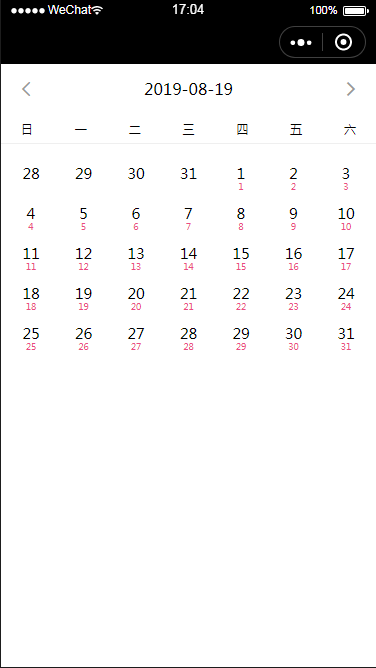
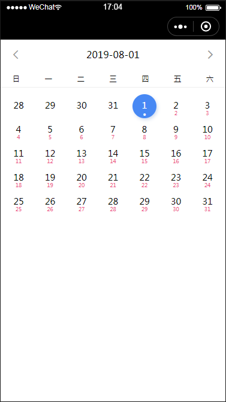
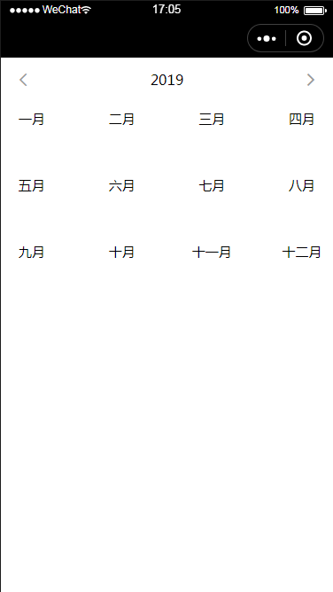

# 微信小程序日历插件

## 引入插件
### json
```
{
  "usingComponents": {
    "my-calendar": "/plugin/components/zf-lalendar"
  }
}
```
wxml
```
<my-calendar></my-calendar>
```
## 插件属性
|属性||类型||默认值||必填||说明|
|:------:||:------:||:------:||:------:||:------:|
|data||Array||null||否||日期下备注，示例：{date: '2019-08-19', label: '春节'}|
|disableOld||Boolean||false||否||小于今天的所有日期是否被禁用|
|disableNull||Boolean||false||否||备注为空的日期是否被禁用|
|changeTime||eventhandle||false||否||点击选择日期事件，回调函数|
|changeCalendar||eventhandle||false||否||点击切换月份，回调函数|




